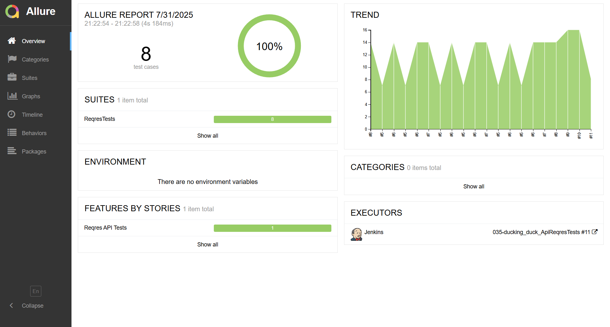

# Тестовый проект для API сервиса [Reqres.in](https://reqres.in/)
> </a> Проект представляет собой автоматизированные тесты для REST API сервиса [reqres.in](https://reqres.in/), реализованные на Java с использованием различных инструментов тестирования.

## **Содержание:**
____

* <a href="#tools">Технологии и инструменты</a>

* <a href="#cases">Примеры автоматизированных тест-кейсов</a>

* <a href="#jenkins">Сборка в Jenkins</a>

* <a href="#allure">Allure отчет</a>
____

## <a name="Технологии и инструменты">**Технологии и инструменты:**</a>

  
  
  
  
  
   
  
  

____

## <a name="Примеры автоматизированных тест-кейсов">**Примеры автоматизированных тест-кейсов:**</a>
____
- ✓ *Получение списка пользователей с использованием метода GET*
- ✓ *Получение одного пользователя с использованием метода GET*
- ✓ *Пользователь не найден с использованием метода GET*
- ✓ *Создание пользователя с использованием метода POST*
- ✓ *Обновление пользователя с использованием метода PUT*
- ✓ *Удаление пользователя с использованием метода DELETE*
- ✓ *Успешная регистрация с использованием метода POST*
- ✓ *Неуспешная регистрация с использованием метода POST*

  ____

## </a>Сборка в [Jenkins](https://jenkins.autotests.cloud/job/035-ducking_duck_ApiReqresTests/)</a>
____

  
  

